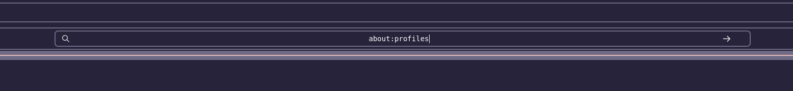
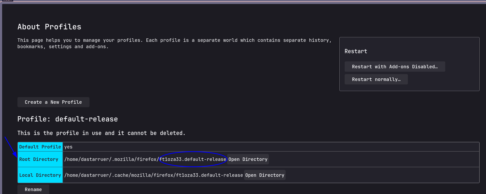

The following dependencies are required:
- 
- btop (System resources)
- cava (Audio visualizer)
- kitty (Terminal emulator)
- neofetch (Fetch script)
- picom (Compositor for transparency, blur, etc.)
- polybar (Status bar)
- pywal (Theme switching)
- rofi (App launcher)
- spicetify (Spotify themeing)
- yazi (Terminal file browser)

You will also need `stow` to symlink all the files from this repo to your `~/.config` directory (except for `wallpapers`, which will be stored in `~/Pictures`):
```bash
stow btop
stow cava
stow firefox-chrome
...
```

## `firefox-chrome`
Since Firefox CSS settings are stored in different directories across systems, you will need to do a bit of work.

First, open Firefox and go to `about:profiles` in the search bar:


Then, take note of this directory:


You might realize that this is the same path as `firefox-chrome/.mozilla/firefox/ft1oza33.default-release/`. All you need to do is change `ft1oza33.default-release` to the directory that you see in `about:profiles`. Then, just re-run
```bash
stow firefox-chrome
```